Tutoriel pas à pas
==================

.. role:: python(code)
   :language: python

.. role:: console(code)
   :language: console

.. note::
   Les exemples de fichiers et de code sont simplifiés pour l'explication et ne correspondent pas forcément à la version finale plus complète présente sur le dépôt.

Étape 1 : La préparation
------------------------

Création du dépôt GitHub
^^^^^^^^^^^^^^^^^^^^^^^^

Pour voir les bases de Git : `(Très) courte introduction à Git <https://tmonseigne.github.io/Memo_Git/>`_.

Initialisation du dépôt
^^^^^^^^^^^^^^^^^^^^^^^^

Lors de l'initialisation, depuis le site GitHub, vous serez guidé pour créer ces 3 fichiers essentiels à tout dépôt :

- :console:`README.md` : Contient une description de votre projet.
- :console:`LICENSE` : Choisissez une licence à l’aide de `Choose a license <https://choosealicense.com/>`_.
  Ce fichier est essentiel, même si vous ne vous occupez pas des droits de votre code (une licence MIT par exemple est très permissive).
- :console:`.gitignore` : Générez ce fichier à partir des templates fournis et adaptez selon vos besoins.

Pour les projets Python, un fichier de configuration supplémentaire est vivement recommandé :console:`requirements.txt` ou :console:`pyproject.toml`.
Ils permettent, à minima, l'installation des dépendances de façon simplifiée. En voici un exemple :

.. code:: python

    # Dépendances du module
    colorama    # Permets l'affichage de la couleur dans la console.

    # Dépendances pour les Tests (pytest et ses "plugins")
    pytest
    pytest-cov
    pytest-json
    pytest-json-report

    # Dépendances pour la documentation
    sphinx
    sphinx-autobuild
    sphinx-rtd-theme

`requirements.txt de ce template <https://github.com/tmonseigne/Python-CI-Template/blob/master/requirements.txt>`_.

Les pre-commits
^^^^^^^^^^^^^^^

Les pre-commits permettent d’automatiser des vérifications avant chaque commit (par exemple, la validation du code).

- Installez le package Python pre-commit avec la commande : :console:`pip install pre-commit`
- Ajoutez un fichier .pre-commit-config.yaml à la racine du projet avec le contenu suivant :
   .. code:: yaml

      repos:
      - repo: https://github.com/pre-commit/pre-commit-hooks
      rev: v5.0.0
      hooks:
      - id: check-docstring-first       # Vérifie une erreur courante consistant à placer du code avant le docstring.
      - id: check-builtin-literals      # Exige une syntaxe littérale lors de l'initialisation de types intégrés Python vides ou nuls.
      - id: check-case-conflict         # Recherche les fichiers dont les noms pourraient être en conflit sur un système de fichiers insensible à la casse.
      - id: check-illegal-windows-names # Recherche les fichiers qui ne peuvent pas être créés sous Windows.
      - id: check-json                  # Tente de charger tous les fichiers JSON pour vérifier la syntaxe.
      - id: check-toml                  # Tente de charger tous les fichiers TOML pour vérifier la syntaxe.
      - id: check-xml                   # Tente de charger tous les fichiers XML pour vérifier la syntaxe.
      - id: check-yaml                  # Tente de charger tous les fichiers YAML pour vérifier la syntaxe.
      - id: end-of-file-fixer           # Assure que les fichiers se terminent par une nouvelle ligne et uniquement par une nouvelle ligne.
      - id: name-tests-test             # Vérifie que les fichiers de test sont nommés correctement.
      args : [--pytest-test-first]      # Assure que les fichiers de tests correspondent au style `test_.*\.py`.
      - id: trailing-whitespace         # Supprime les espaces de fin de ligne.
      args: [--markdown-linebreak-ext=md]  # Exception pour les fichiers Markdown.

- Initialisez les hooks pre-commit avec la commande : :console:`pre-commit install`

Désormais, chaque commit vérifiera automatiquement le code selon les règles (hooks) définies.
Si une règle échoue, le commit est bloqué jusqu'à la correction.
Vous pouvez chercher des règles supplémentaires et même en créer.

Étape 2 : L'intégration continue
--------------------------------

Le workflow GitHub Action
^^^^^^^^^^^^^^^^^^^^^^^^^

Les workflows permettent d’automatiser des tests ou d’autres actions sur votre projet à chaque commit.

Créez un fichier dans :console:`.github/workflows/ci.yml` :

.. code:: yaml

   name: Template CI   # Nom du workflow

   # Définition de la méthode de lancement du workflow (à quel moment et sur quelle branche)
   on:
     push:
       branches:
         - master
     pull_request:
       branches:
         - master
     workflow_dispatch:  # Permets d'exécuter le workflow manuellement depuis l'onglet Actions

   # Liste des routines qui seront lancées
   jobs:
     Test:
       name: Tests on ${{ matrix.platform }} for Python ${{ matrix.python-version }}
       runs-on: ${{ matrix.platform }} # Environnement (OS) de la routine
       timeout-minutes: 30 # Limite la durée de la routine
       strategy:
         fail-fast: false # Continue les autres routines si une matrice échoue.
         matrix:         # Définition de la matrice de test (ici, pour les 3 OS et 2 versions de python donc 6 lancements)
           platform: [ ubuntu-latest, windows-latest, macos-latest ]
           python-version: ["3.12", "3.13"]

       steps:
         # Récupération du dépôt dans l'environnement
         - name: Checkout code
           uses: actions/checkout@v4

         # Installation de Python
         - name: Set up Python ${{ matrix.python-version }}
           uses: actions/setup-python@v5
           with:
             python-version: ${{ matrix.python-version }}

         # Installation des dépendances du projet
         - name: Install dependencies
           run: |
             python -m pip install --upgrade pip
             python -m pip install -r requirements.txt

         # Lancement des tests avec pytest
         - name: Run tests with pytest
           uses: aganders3/headless-gui@v2
           with:
             run: python -m pytest

Un fichier :console:`pytest.ini` peut être intéressant pour automatiser le passage de certains arguments lors du lancement de la commande.
En voici un exemple :

.. code:: ini

   [pytest]
   # Indiquer où chercher les tests
   testpaths = mon_module/_tests/
   python_files = test_*.py

   # Définir des options de ligne de commande par défaut
   addopts = -s -v --color=yes

Selon les options des plugins à pytest peuvent être nécessaires (ex : :console:`pytest-cov`) et doivent être ajouté au fichier de configuration du projet.

Voici à quoi ressemble la sortie sur GitHub du workflow :

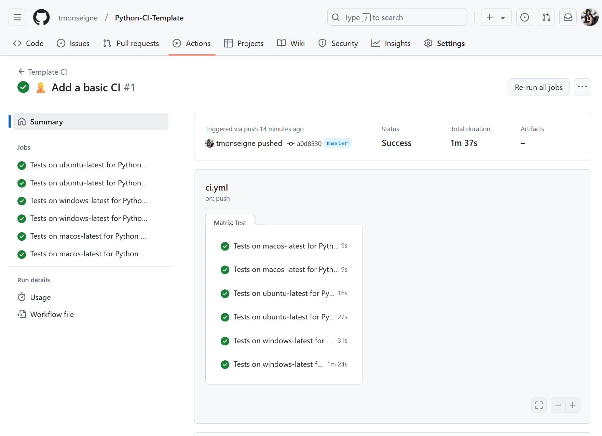

La couverture de code
^^^^^^^^^^^^^^^^^^^^^

La couverture de code mesure quelle proportion de votre base de code est testée.
Un taux élevé (>80%) est souvent un bon objectif, mais il ne garantit pas l'absence de bugs.
Dans le fichier :console:`pytest.ini` précédent, nous pouvons ajouter des arguments afin de générer un rapport de couverture de code :

.. code:: ini

   ...
   addopts = -s -v --color=yes
             --cov=. --cov-report=xml:reports/coverage.xml

Il faut à présent paramétrer le dépôt pour communiquer avec le site `codecov.io <https://app.codecov.io>`_
qui propose une interface simple de visualisation de la couverture de code.
Allez sur le site et connectez-vous avec votre compte GitHub.
Une fois connecté, vous verrez la liste de vos Dépôts et leur couverture de code (pour ceux qui ont envoyé un rapport).
Cliquez sur votre dépôt puis sur configuration, vous aurez une page comme celle-ci :

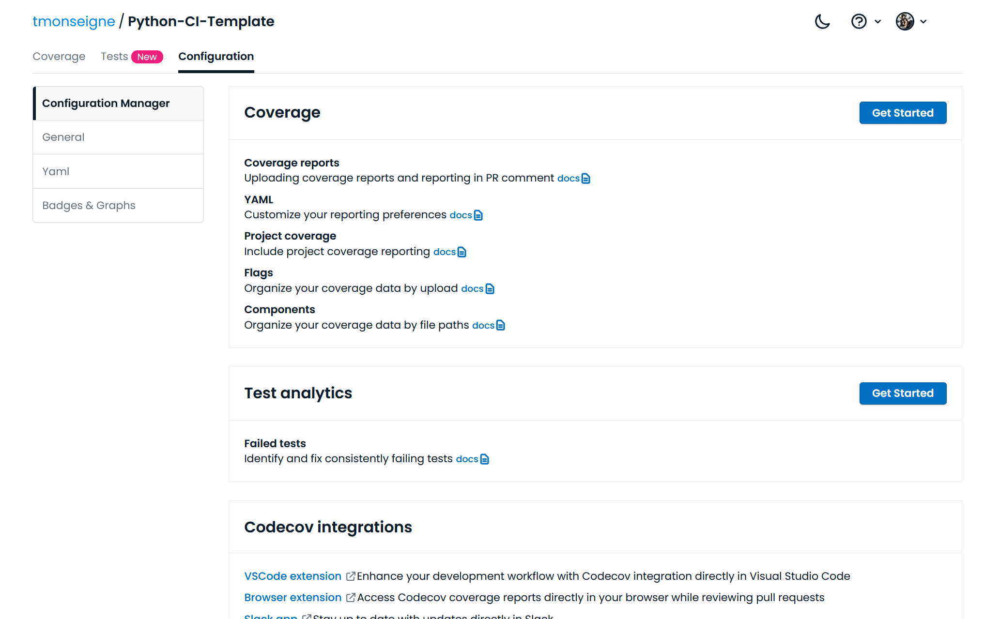

En cliquant sur le premier :menuselection:`Get Started` en haut à droite, cette page apparaitra :

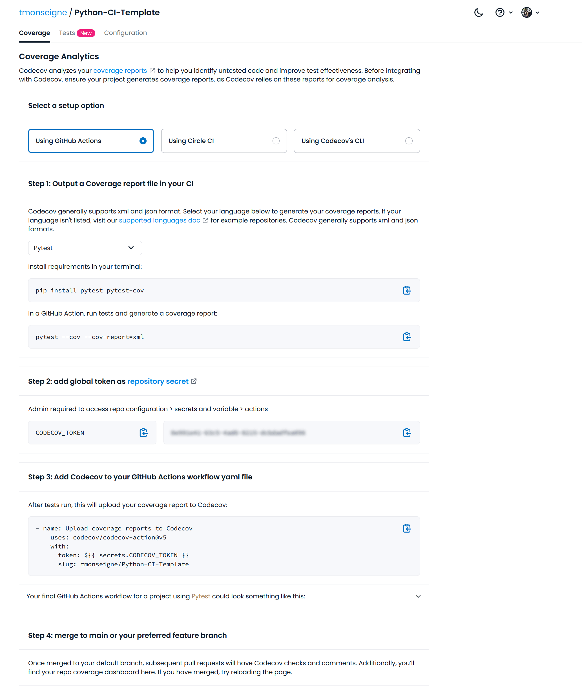

Celle-ci vous donne les indications à suivre pour envoyer vos rapports de couverture de code.
Vous devez choisir GitHub Action et copier le token indiqué en dessous.

Allez ensuite sur votre dépôt GitHub. cliquez sur :menuselection:`Settings --> Secrets and variables --> Actions`
puis sur le bouton :menuselection:`New repository secret`.

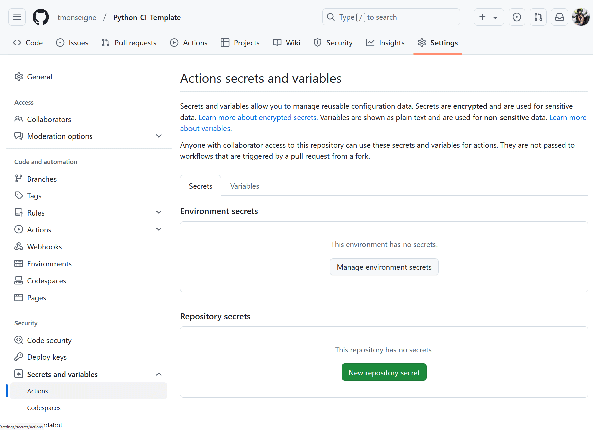

Une nouvelle page apparait ou vous devrez donner un nom à votre variable et renseigner le token récupéré précédemment.

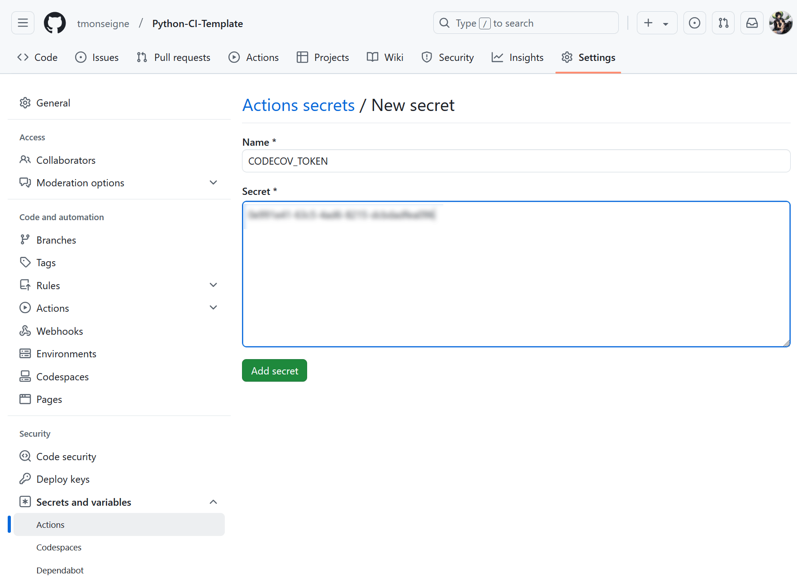

Une fois validé, vous retournez au menu précédent et la variable apparait dans la liste (le token est évidemment caché).

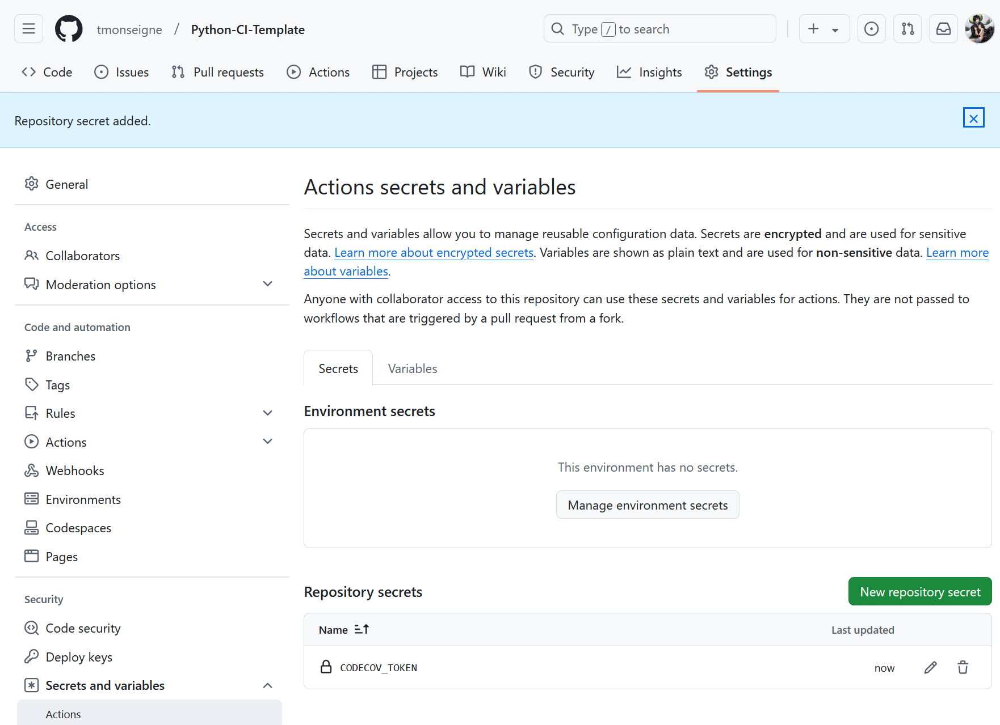

Vous devez maintenant modifier votre fichier de workflow pour inclure l'envoi du rapport.
Ici, on limite l'exécution de cette commande à un seul des environnements de test,
car Codecov ne supportera pas de recevoir plusieurs rapports à chaque mise à jour.

.. code:: yaml

   # Upload du test sur codecov.io (nécessite l'ajout d'une variable secrète)
   - name: Upload coverage report to Codecov
     if: matrix.platform == 'ubuntu-latest' && matrix.python-version == '3.13'
     uses: codecov/codecov-action@v5
     with:
       token: ${{ secrets.CODECOV_TOKEN }}

La mise à jour sur le site codecov se fera automatiquement (il faut parfois attendre quelques minutes).

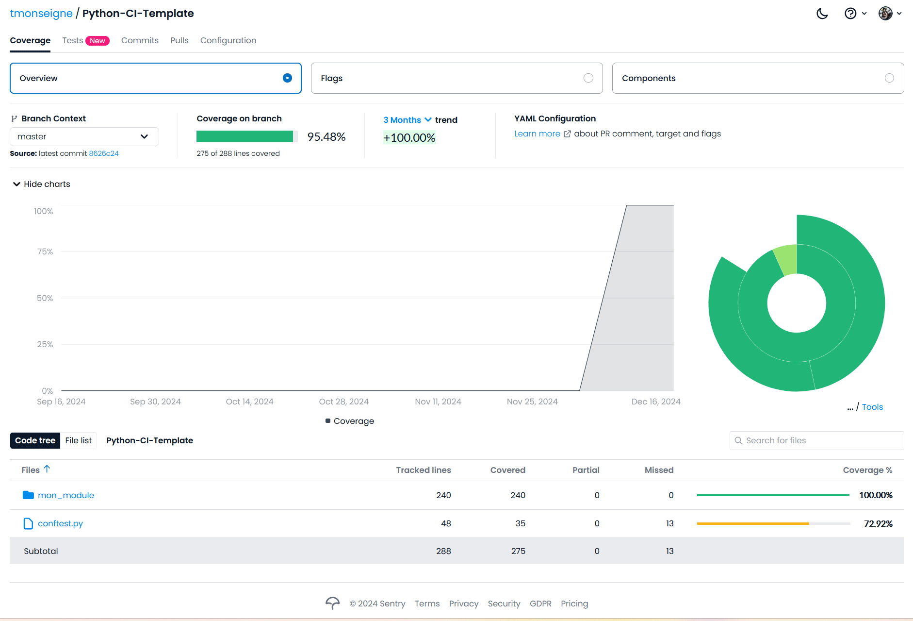

La documentation
^^^^^^^^^^^^^^^^

La documentation doit aussi être généré et mise à jour régulièrement et si possible automatiquement.
Avec python, nous utilisons `Sphinx <https://www.sphinx-doc.org/fr/master/>`_.
Ce n'est pas le seul, mais c'est le plus répandu pour ce langage.
Sphinx possède un outil pour créer une configuration minimale pour la documentation.
Il créé différents fichiers tels que : :console:`make.bat`, :console:`Makefile`, :console:`index.rst`, :console:`conf.py`.
Vous pouvez copier les fichiers présents sur ce dépôt ou les créer à partir de l'outil intégré à Sphinx.

Pour démarrer, il faut configurer les GitHub Pages qui recevront la documentation dans :menuselection:`Settings --> Pages`.
Il faut sélectionner la méthode de génération en cliquant sur :menuselection:`Build and deployment --> Source --> GitHub Actions`

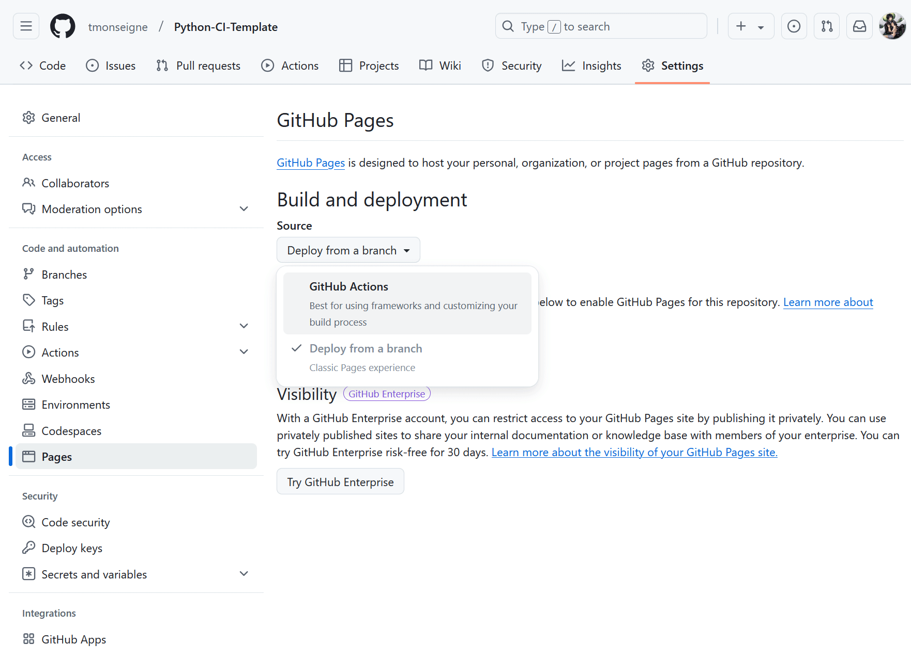

Il faut ensuite ajouter un Job au workflow du GitHub Action.
Dans le fichier :console:`ci.yml`, il faut ajouter à la suite :

.. code:: yaml

   Documentation:
     name: Build and Deploy Sphinx Documentation
     needs: Test    # Nécessite la réussite du Job précédent nommé `Test`
     runs-on: ubuntu-latest

     steps:
       # Récupération du dépôt dans l'environnement
       - name: Checkout code
         uses: actions/checkout@v4

       # Installation de Python
       - name: Set up Python
         uses: actions/setup-python@v5
         with:
           python-version: '3.13'

       # Installation des dépendances du projet
       - name: Install dependencies
         run: |
           python -m pip install --upgrade pip
           pip install -r requirements.txt

       # Génération de la documentation
       - name: Build documentation
         run: |
           sphinx-apidoc -o docs/generated ./mon_module  # Pour générer la documentation API dans `docs/generated`
           sphinx-build -b html docs/ docs/_build/html   # Pour construire le HTML

       # Préparation des GitHub Pages.
       - name: Setup Pages
         uses: actions/configure-pages@v5

       # Conserve en tant qu'artefact le site généré pour une utilisation ultérieure
       - name: Upload documentation to GitHub Pages artifact
         uses: actions/upload-pages-artifact@v3
         with:
           path: 'docs/_build/html'

       # Déploiement sur les GitHub Pages.
       - name: Deploy to GitHub Pages
         id: deployment
         uses: actions/deploy-pages@v4

Après une mise à jour de l'intégration continue, vous verrez un changement dans les paramètres Pages : :menuselection:`Settings --> Pages`.

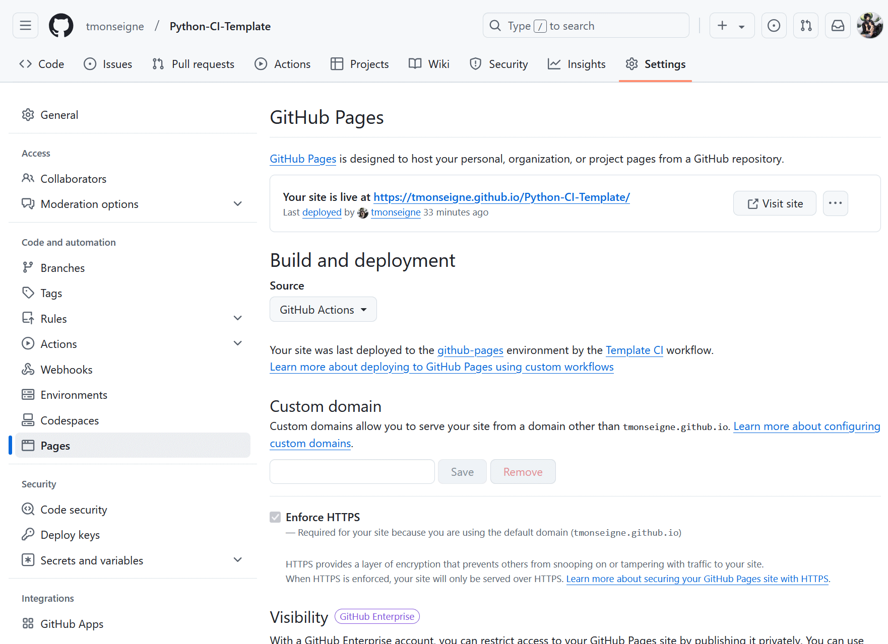

Vous connaissez alors le lien vers votre documentation. Il aura toujours la forme : :console:`https://<nom_utilisateur>.github.io/<nom_depot>/`
Si vous cliquez dessus, vous verrez votre page index.

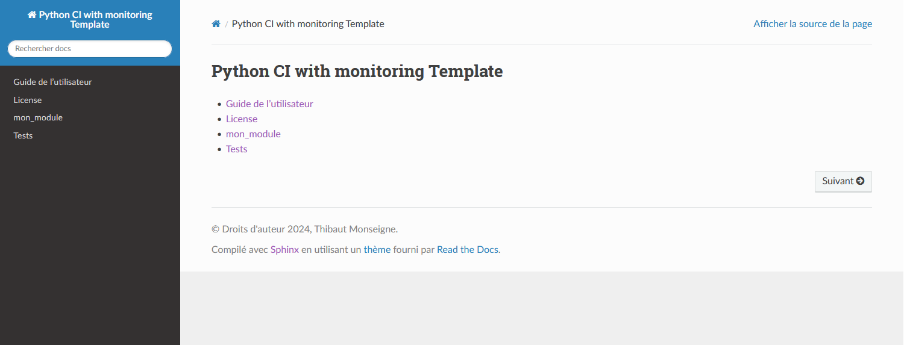

Sphinx permet de faire un grand nombre de choses pour la documentation.
Avec quelques petits ajustements, par exemple, vous pourrez également ajouter le résultat de vos tests.
Des outils sont fournis avec ce dépôt, mais la mise en forme de ce rapport dépend de vos goûts.

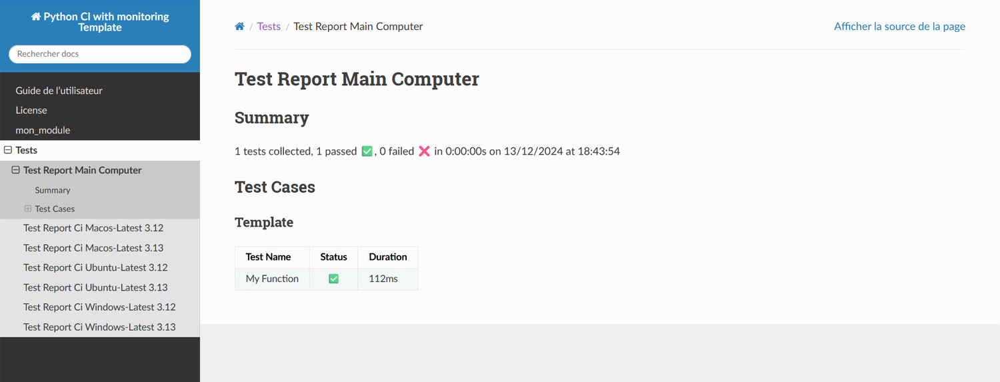

Étape 3 : Un peu plus loin
--------------------------

Les releases
^^^^^^^^^^^^

Les releases permettent de publier des versions stables de votre projet.

- Créez une nouvelle release dans l’interface GitHub (onglet Releases).
- Ajoutez un tag (par exemple, v1.0.0) et une description des changements.
- Publiez la release.

Voici un exemple :

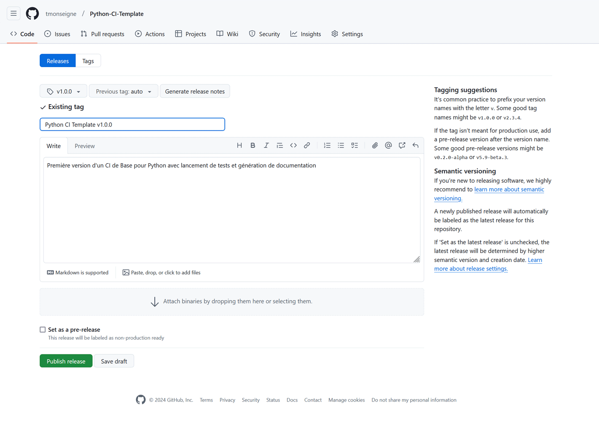

La génération de rapports avec un monitoring des ressources
^^^^^^^^^^^^^^^^^^^^^^^^^^^^^^^^^^^^^^^^^^^^^^^^^^^^^^^^^^^

Il est possible lors de l'exécution des tests de surveiller l'utilisation des ressources.
La version 2 de ce template ajoute les fichiers nécessaires au monitoring et la modification du comportement de pytest.
Voir ces fichiers pour plus d'informations.

Voici le résultat de cet ajout dans le rapport de test.

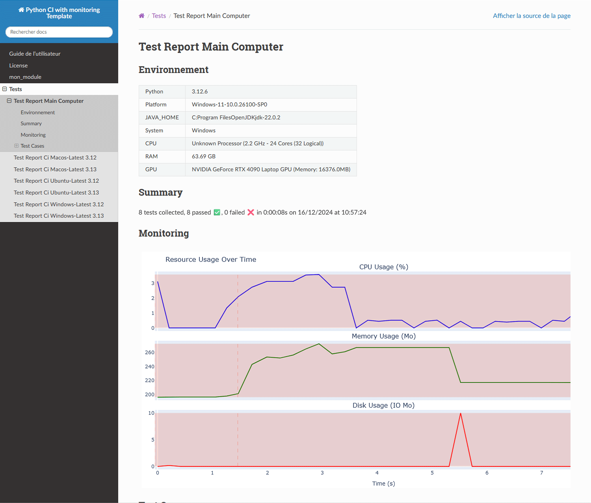

Les badges
^^^^^^^^^^

Les badges sont de petits ajouts utilisés dans le readme et parfois la documentation pour indiquer l'état du projet de façon rapide.
Ce système est largement répandu et grâce au site `Shields.io <https://shields.io/>`_, un ensemble de badges peut-être généré automatiquement.
Les éléments souvent indiqués sont le nom de la licence, le lien vers la documentation, l'état de l'intégration continue (réussite ou échec)...

.. image:: https://img.shields.io/github/license/tmonseigne/Python-CI-Template
   :target: license.html
   :alt: GitHub License

.. image:: https://img.shields.io/github/actions/workflow/status/tmonseigne/Python-CI-Template/ci.yml
   :target: https://github.com/tmonseigne/Python-CI-Template/actions/workflows/test.yml
   :alt: GitHub Actions Workflow Status

.. image:: https://img.shields.io/github/languages/top/tmonseigne/Python-CI-Template
   :target: https://github.com/tmonseigne/Python-CI-Template
   :alt: GitHub top language

.. image:: https://codecov.io/github/tmonseigne/Python-CI-Template/graph/badge.svg?token=KSQ8lfMZW8
   :target: https://codecov.io/github/tmonseigne/Python-CI-Template
   :alt: Codecov

.. image:: https://img.shields.io/badge/Documentation-Online-brightgreen
   :target: https://tmonseigne.github.io/Python-CI-Template/
   :alt: Documentation

.. note::
   Les dépôts privés peuvent poser problème pour certains badges, car `Shields.io <https://shields.io/>`_ ne pourra pas y accéder.
